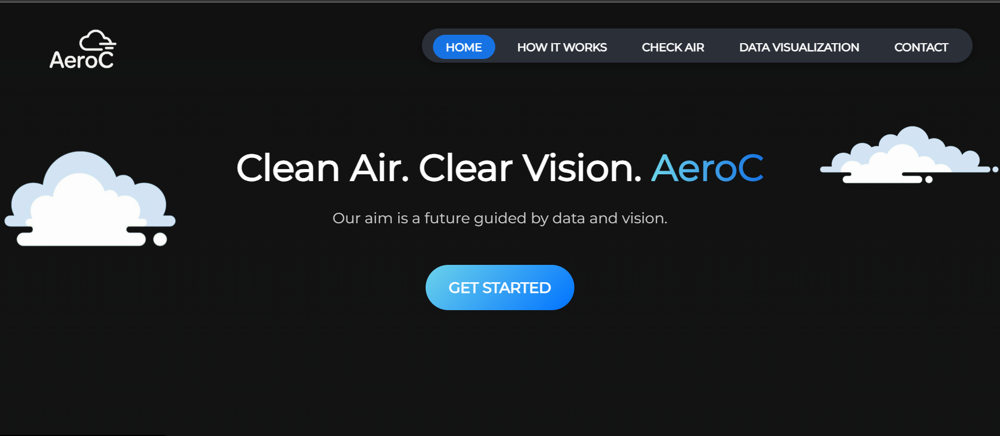
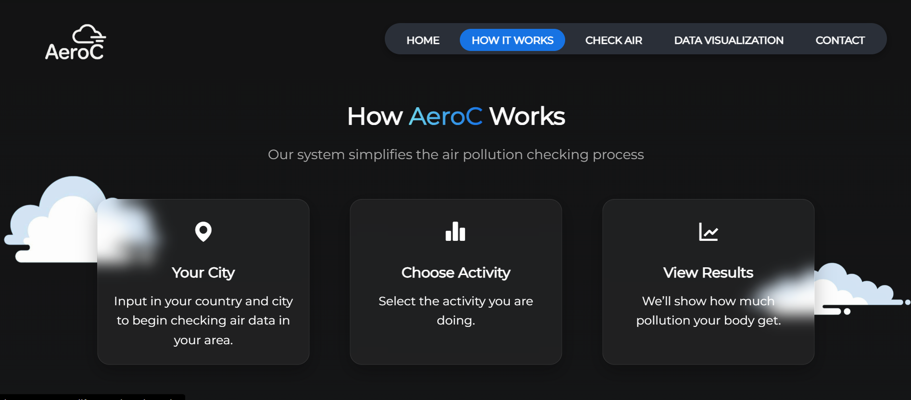
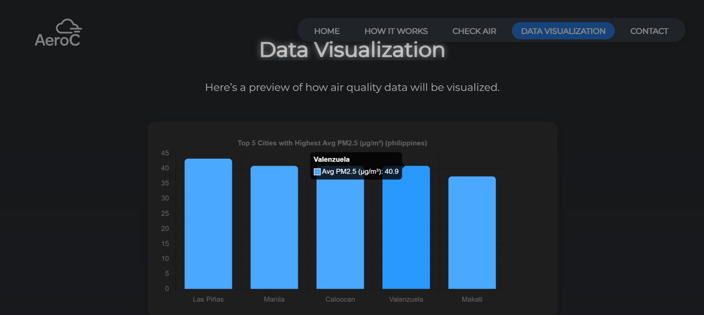
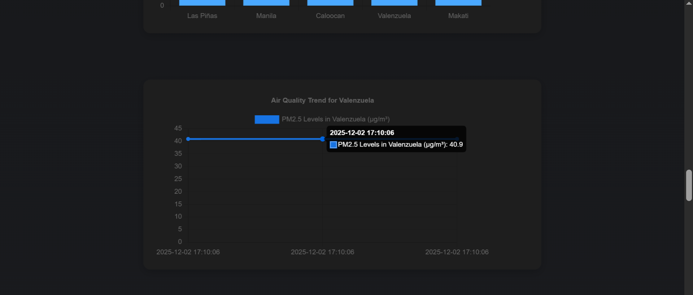
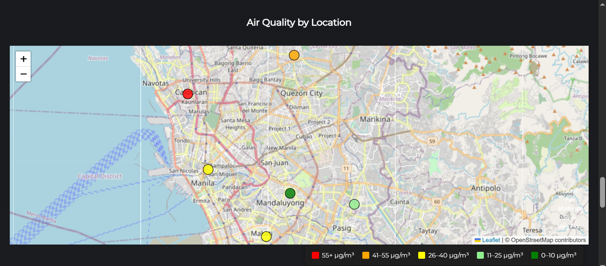

  

### See the Air, Breathe Aware
Track, simulate, and protect yourself from harmful particles in the air you breathe.

AeroC is a web-based platform developed during the **AWS Solar Power Hackathon 2025**, held at **Arthaland Century Pacific Tower** on August 18, 2025. The project empowers individuals and communities by providing real-time tracking and visualization of air pollution levels using cloud-powered infrastructure.

---

## Problem Statement

Air pollution poses a severe threat to global health and ecosystems. Harmful particles and gases—whether natural or man-made—pollute the air we breathe. According to the State of Global Air 2024 Report, air pollution is one of the leading environmental threats to human well-being, contributing to **8.1 million deaths globally** each year.

Communities need an accessible, real-time tool that helps them become aware of risks and make informed decisions to protect themselves.

---

## Our Solution: AeroC

**AeroC** is a **web-based air quality monitoring platform** that allows users to visualize, track, and understand harmful particles in their surroundings. It helps users make informed decisions by providing:

- Real-time particle tracking  
- Pollutant simulation and insights  
- User-friendly visualization  
- Awareness tools that promote environmental health  

> **See the Air, Breathe Aware!**  
> Track, Simulate, and Protect Yourself from Harmful Particles.

---

## AWS Integration & Architecture

AeroC is optimized using AWS serverless and cloud technologies.

### Amazon S3  
Used for reliable and scalable storage of datasets and resources used in air quality tracking.

### Amazon EC2  
Served as the virtual server used to host and run the web application, offering flexible scaling and stable performance.

### AWS Architecture Overview  
The system includes S3 for data storage, EC2 for hosting, and additional serverless components for scalability and reliability.

---

## Features

- ✔️ Air quality tracking and pollutant monitoring  
- ✔️ Real-time visual simulation  
- ✔️ Clean and responsive UI  
- ✔️ Cloud-powered backend  
- ✔️ Focused on Risk · Check · Protect · Community  

---

## Tech Stack

### **Frontend**
- HTML  
- CSS 
- JavaScript  
- Swiper.js  
- Leaflet.js (for map visualization)  
- Responsive design

### **Backend**
- Node.js / Express  
- AWS SDK  
- REST API endpoints for GeoJSON and air quality data  

### **Cloud & Infrastructure**
- Amazon S3 (data storage)  
- Amazon EC2 (hosting)  
- Serverless AWS components where applicable  

### **Other Tools**
- Git & GitHub  
- Collaboration workflow for hackathon development  

---

## Live Demo

**http://57.180.251.27/**  
(*Note: This instance was from the hackathon and may no longer be active.*)

---
### Screenshots

#### Landing Page

#### Simulation View

#### Data Visualization

#### Air Quality Map

---

### Demo

---

## 👥 Team AeroC

| Name     | Role                |
|----------|----------------------|
| Aaron    | Frontend Developer   |
| Kurt     | Backend Developer    |
| Ronald   | Cloud Architect      |
| Cedric   | Quality Assurance    |

---

## Impact

AeroC promotes awareness and environmental consciousness by helping users:

- Identify pollution risks  
- Understand air quality data  
- Protect themselves and their communities  
- Engage in long-term environmental responsibility  

---

## License

This project is licensed under the **MIT License**.  
Feel free to use, modify, and enhance the platform for educational and research purposes.

---

## Acknowledgment

Special thanks to **AWS**, the organizers of the **AWS Solar Power Hackathon 2025**, and all mentors who supported the development of AeroC. Being able to participate—and win—during our first hackathon was an experience that truly motivated us to keep building.

